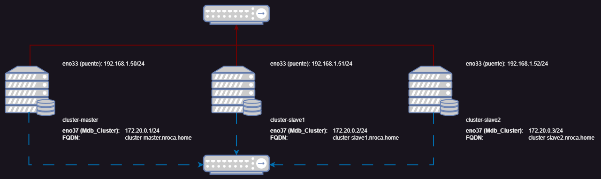

# Galera Cluster MariaDB

Galera Cluster és un servicio de replicación y creación de clusters de bases de datos MySQL y MariaDB distribuidas, donde cada nodo del clúster tiene una copia de los datos completa. En caso del fallo de uno de los nodos garantizamos la disponibilidad e integridad de los datos, y en caso de un funcionamiento correcto, la acceleración de las lecturas de nuestra base de datos.

## Topologia

Como podemos ver en la imagen de la topologia contamos con tres nodos, un master (cluster-master.nroca.home) y dos esclavos (cluster-slave1.nroca.home) y (cluster-slave2.nroca.home).

Los servidores corren sobre VMware Workstation Pro, cada uno con 6 Gb RAM, 2 Cores y 64 Gb de disco, con acceso a internet con un adaptador puente, y a una red interna privada (solo para las maquinas virtuales) Con el rango de IPs 172.20.0.0/24.

Podemos ver las connexiones puente en la linea roja y adaptadores `ens33`, y las connexiones privadas en la linea de puntos azul y adaptadores `ens37`:

## Instalación

## Configuración 

### Servidor master

### Servidor esclavo 1

### Servidor esclavo 2

