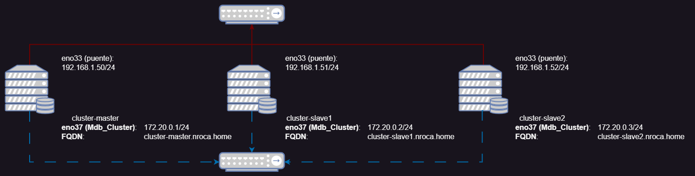

# Galera Cluster MariaDB

Galera Cluster es un servicio de replicación y creación de clusters de bases de datos MySQL y MariaDB distribuidas, donde cada nodo del clúster tiene una copia de los datos completa. En caso del fallo de uno de los nodos garantizamos la disponibilidad e integridad de los datos, y en caso de un funcionamiento correcto, la aceleración de las lecturas de nuestra base de datos.

<br>

## Topologia

Como podemos ver en la imagen de la topología contamos con tres nodos, un master (cluster-master.nroca.home) y dos esclavos (cluster-slave1.nroca.home) y (cluster-slave2.nroca.home).

Los servidores corren sobre VMware Workstation Pro, cada uno con 6 Gb RAM, 2 Cores y 64 Gb de disco, con acceso a internet con un adaptador puente, y a una red interna privada (solo para las máquinas virtuales) Con el rango de IPs 172.20.0.0/24.

Podemos ver las conexiones puente en la línea roja y adaptadores 'ens33', y las conexiones privadas en la línea de puntos azules y adaptadores 'ens37':



<br>

## Instalación

Paquetes necesarios: mariadb-server, mariadb-client, galera-4

En caso de tener un número de nodos pares seria recomendable instalar `galera-4-arbitrator`, para gestionar "split-brain scenarios" escenarios en los que se cae algun nodo y se requiere tomar decisiones entre los nodos restantes.

Para la instalacion usaremos apt:

```
sudo apt update
sudo apt install -y mariadb-server mariadb-client galera-4
```

* Configuración segura

    Y ejecutamos `mysql_secure_installation` en todos los nodos para asegurar las instalaciones, y

    * Configuramos contraseña del user root.
    * Quitamos usuarios anonimos.
    * Quitamos acceso root remoto (opcional pero recomendado).
    * Quitamos BD de prueba.
    * Recargamos la tabla de privilegios.

    <br>


* Configuración Firewall

    En caso de tener un firewall instalado, és necesario permitir el tràfico por los siguientes puertos:

    * Puerto 3306 (MySQL)
    * Puerto 4567 (Tráfico de replicación del clúster Galera)
    * Puerto 4568 (Transferencia de estado incremental de Galera)
    * Puerto 4444 (Transferencia de instantáneas de estado de Galera)

<br>

## Configuración 

### Servidor master

### Servidor esclavo 1

### Servidor esclavo 2

