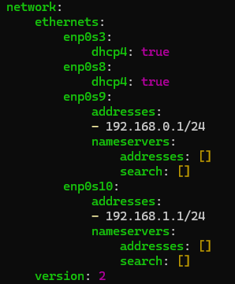
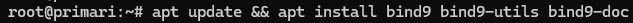
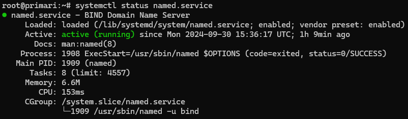
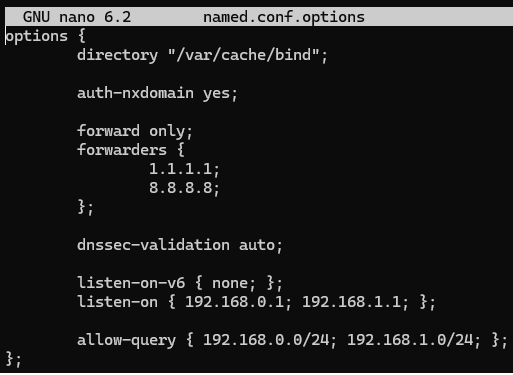
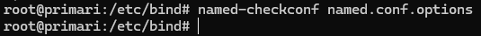
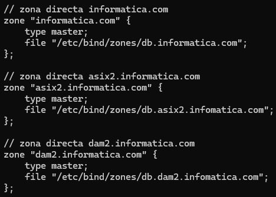
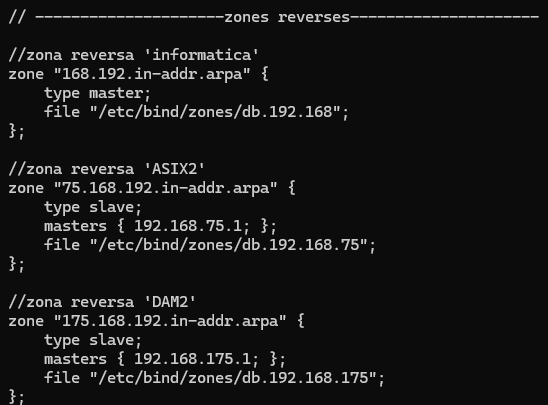
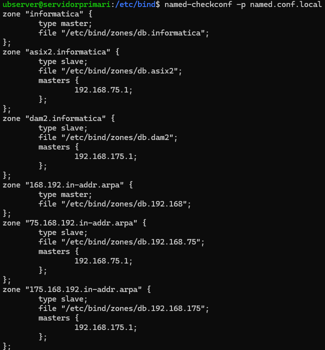

## Setup previo

Esta és la configuración de cada una de las redes, enp0s3 para acceso a internet, enp0s8 para acceso a la red privada "ASIX2" y enp0s9 para acceso a la red privada "DAM2":

## Instalación de paquetes

- Instalamos "bind9", "dnsutils" y "bind9-doc" con apt:

    `sudo apt install bind9 bind9-utils bind9-doc`

    

    * `bind9`: És el paquete que instalara named, el servidor dns como tal.
    * `bind9-utils`: Añadeasd
    * `bind9-doc`: Nos descarga un manual del servidor named, lo podemos encontrar en `/usr/share/doc/bind9-doc/`.

- Comprobamos que named.service esta iniciado y funcional:

    

*Aclaracion: "bind9" és el nombre del paquete, y "named" és el nombre del servicio.*

## Configuración general

- /etc/bind/named.conf.options

    Editaremos el archivo `named.conf.options` para configurar opciones generales de bind9.

    - `directory "/var/cache/bind";` Configuramos el directorio en el que se guardaran los archivos para la cache del dns (no hace falta editarlo).

     

    - `forward only;` Las queries externas no se comprovaran en el servidor, se pasaran directamente a los servidores forwarders.

     

    - `auth-nxdomain yes;` Se usa para configurar como el servidor responde a dominios no existentes (NXDOMAINS response) si és configurado en "yes", si el servidor no encuentra el dominio en una de sus zonas usara uno de los DNS's forwarder para responder al cliente.

     

    - `forwarders {x.x.x.x};` Cuando un cliente haga una query y el servidor no tenga el dominio en una de sus zonas, usará el servidor configurado para re-enviar la peticion y luego guardarla en su cache.

     

    - `dnssec-validation auto;` bind9 validara las firmas de zona para asegurarse que las respuestas són autenticas y no han sido modificadas (recomendable dejarlo en auto).

     

    - `listen-on-v6 { };` o `listen-on-v4 { };` Podemos configurar en que IPs queremos escuchar para peticiones, podemos configurar-lo como "none" para que no escuche en ninguna IP, dar una IP por ejemplo "192.168.75.1", o para que escuche en cualquier IP "any".
  
    - `allow-query { x.x.x.x/xx; }` Configuraremos que rango de IPs pueden hacer una query a nuestro servidor DNS.

     

    

     

    Una vez configurado el archivo usaremos `named-checkconf named.conf.options`, de esta forma comprobamos si hay algun error sintactico en nuestra configuración, en caso de no haber ninguno, no obtendremos salida:

    

 

- /etc/bind/named.conf.local

    - zonas directas
        Definiremos que archivos usar para cada una de las zonas.
        
        Necesitamos definir, la zona, será el dominio al cual responderá. El tipo será "master" ya a que es la zona principal de este dominio, y el archivo, que pondremos dentro de una nueva carpeta llamada "zones" para mantener-lo todo ordenado.

        
    

    - zona reversa

        Tambien necesitamos configurar las zonas reversas, habran tantas zonas reversas como directas, en esta tambien necesitamos configurar el nombre de la zona (acostumamos a poner la subnet, seguido de "in-addr.arpa" para identificar cada subred), seguido del tipo, si es de tipo slave necesitamos configurar la IP maestra, y el archivo tambien en <strong>ruta absoluta</strong>:

        

 

- Comprovacion de /etc/bind/named.conf.local

    Usando "named-checonf -p named.conf.local" compovaremos que no haya ningun error de sintaxis:

    
