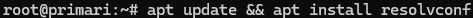
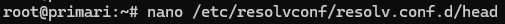
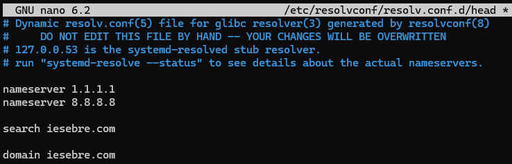
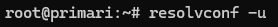

## Instalación

Instalaremos resolvconf con apt:

## Configuración

Para hacer las configuraciones, entraremos a `/etc/resolvconf/resolv.conf.d/head`

Las configuraciones del archivo son iguales a las de `/etc/resolv.conf`:

* `nameserver`: Configuramos un servidor DNS, podemos configurar hasta 4.
* `search`: Configuramos un dominio con el que autocompletar un host que no esté completamente cualificado, por ejemplo, configuramos en search `iesebre.com' y hacemos una query de `host01`, se completará como' host01.iesebre.com'
* `domain`: Harà lo mismo que `search`, pero solo podemos usar un dominio, mientras que con search podemos usar múltiples.

Aqui un ejemplo de configuración:

 

Último, para aplicar los cambios usamos `resolvconf -u`

