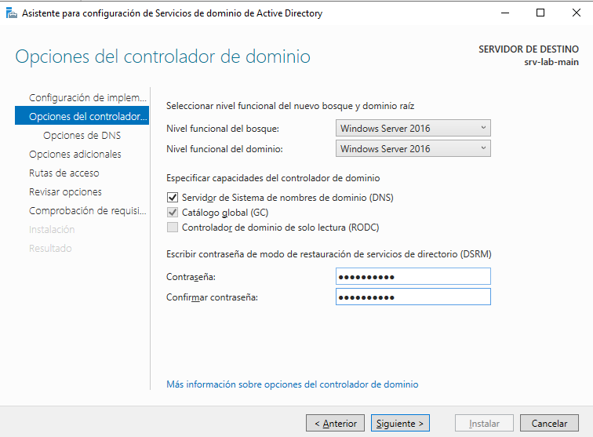

# Cración de un dominio AD

## Pasos previos

Nos aseguraremos de tener nuestros adaptadores de red configurados correctamente, "Ethernet0" actuarà como un adaptador NAT que darà servicio a nuestro servidor, y lo mantedremos en DHCP, mientras que "Ethernet1" darà servicio a nuestra red interna y lo configuraremos con la ip `172.40.0.1/24`, sin un dns (por el momento), sin gateway, y con "IPv6" desactivado.

## Instalacion

Para configurar un controlador de dominio usaremos "Agregar roles y características":

 

Seleccionaremos una instalacion basada en caracteristicas o roles:

 

Seleccionamos `Servicios de dominio de Active Directory`:

 

Comprovamos que instalamos los roles que queremos:

 

Y confirmamos que se instala sin problema:

 

## Configuracion

Una vez terminada la instalacion, en el apartado de avisos, podemos ver la opción para "Promover este servidor a controlador de dominio":

 

Seleccionaremos la opcion "Agregar nuevo bosque:

 

Introducimos nuestra contraseña:

 

Revisamos las opciones, y, podemos descargar un script para, si en un futuro, queremos añadir un controlador secundario.

[Script](./scripts/script-promover-controlador.txt)

 

Comprovamos los requisitos previos, habrà algunos avisos que vamos a ignorar.

 

Y comprobamos que se han realizado los cambios:

 

Una vez reiniciado, podemos ver que nuestro usuario administrador se inicia sobre el dominio:

 

Y en el administrador de servidor, podemos ver un apartado para "AD DS" y "DNS" sin errores:

