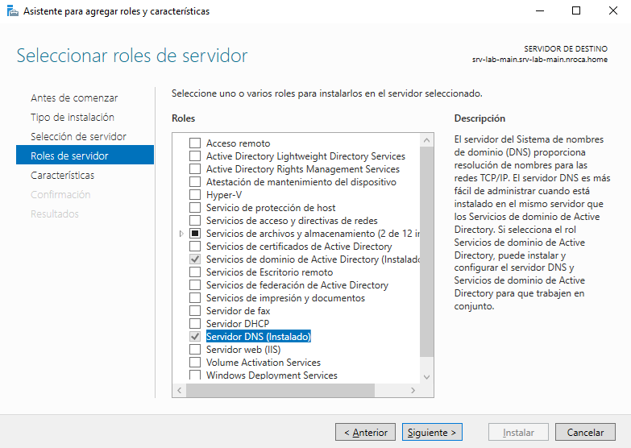
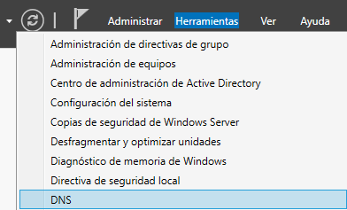

# Servicios en Windows Server

## 1. DNS

### Instalacion

Instalaremos el servicio des-de el asistente para agregar roles y caracterisitcas, en caso de haber creado un dominio primero, este ya se encuentra instalado:

### Configuracion

Configuraremos el servicio desde el apartado "Herramientas/DNS":

## 2. DHCP