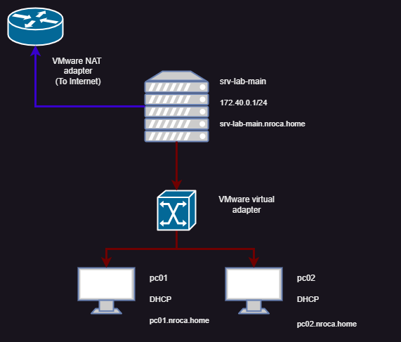

# Configuración de un dominio Active Directory (AD)

Para nuestro laboratorio usaremos un servidor "Windows Server 2022", que harà de controlador de dominio, dhcp, dns, enrutador, y otros.

Este és el diagrama de red que usaremos:

Usaremos un adaptador (NAT) de vmware para acceder a internet desde nuestro servidor, que configuraremos como enrutador, y de esta forma dar servicio a nuestros clientes por la red interna (172.40.0.0/24).

## Dominio

[Cración de un dominio AD](./1-CracionDominio/CracionDominio.md)

## Usuarios

### Perfiles Remotos

### Scripts inicio de sesion