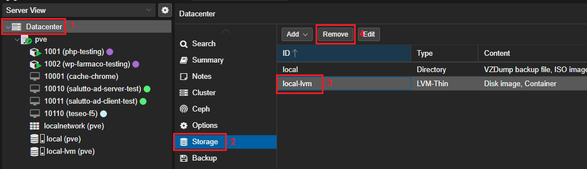

## Borrar directorio local-lvm y redimensionar directorio local

Para esto hay que eliminar el directorio local desde la WebUI, en el apartado "Datacenter/Storage", donde borraremos el "LVM-Thin" "Local-lvm":

Después  ejecutar `lvdisplay pve` para comprobar los directorios

* Desactivamos el volumen `data`:
    `lvchange -an /dev/pve/data`
* Eliminamos el volumen:
    `lvremove /dev/pve/data`
* Redimensionamos el directorio root:
    `lvextend -l +100%FREE /dev/pve/root`
* Redimensionamos el sistema de archivos:
    `resize2fs /dev/pve/root`
* Comprobamos cambios:
    `df -h`