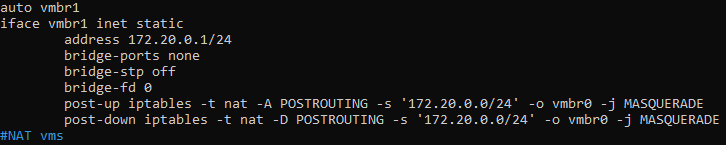
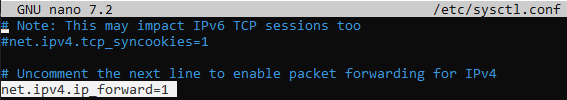
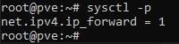

## Crear una interfaz NAT para las Máquinas Virtuales

Por defecto, las instalaciones de Proxmox crean un Linux Bridge en la interfaz seleccionada durante la instalación, generalmente llamada `vmbr0`. En este caso, vamos a crear una nueva interfaz, `vmbr1`, que no estará vinculada a ninguna de las interfaces físicas y usará iptables para realizar NAT. De esta manera, las máquinas virtuales podrán utilizar la IP del host Proxmox.


Esta és la configuración de la interfaz `vmbr1`:



Debajo de esta crearemos la configuración de `vmbr1`:

```
auto vmbr1
iface vmbr1 inet static
        address 172.20.0.1/24
        bridge-ports none
        bridge-stp off
        bridge-fd 0
        post-up iptables -t nat -A POSTROUTING -s '172.20.0.0/24' -o vmbr0 -j MASQUERADE
        post-down iptables -t nat -D POSTROUTING -s '172.20.0.0/24' -o vmbr0 -j MASQUERADE
```

<br>

## Configuración NAT

Necesitamos editar el archivo `/etc/sysctl.conf`, y descomentamos `net.ipv4.ip_forward=1`, de esta forma habilitaremos la modificación de paquetes y de esta forma hacer NAT.



Y aplicamos los cambios con `sysctl -p`:




echo 1 | sudo tee /proc/sys/net/ipv4/ip_forward


## NAT port forwarding

192.168.180.44 és la ip de la maquina real
172.20.0.10 és la ip de la mv
222 és el puerto de la mv que escucha 

-A PREROUTING -d 192.168.180.44/32 -p tcp -m tcp --dport 222 -j DNAT --to-destination 172.20.0.10:222
-A PREROUTING -i vmbr0 -p tcp -m tcp --dport 222 -j DNAT --to-destination 172.20.0.10:222
-A POSTROUTING -s 172.20.0.0/24 -o vmbr0 -j MASQUERADE
-A POSTROUTING -s 172.20.0.0/24 -o vmbr0 -j MASQUERADE