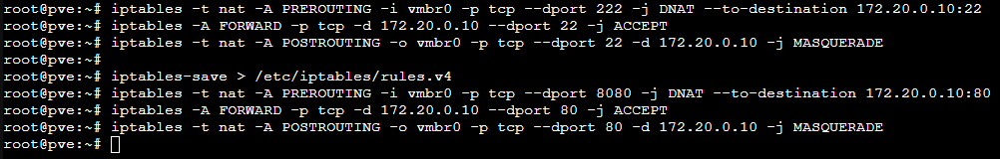

## Crear una interfaz NAT para las Máquinas Virtuales

Por defecto, las instalaciones de Proxmox crean un Linux Bridge en la interfaz seleccionada durante la instalación, generalmente llamada `vmbr0`. En este caso, vamos a crear una nueva interfaz, `vmbr1`, que no estará vinculada a ninguna de las interfaces físicas y usará iptables para realizar NAT. De esta manera, las máquinas virtuales podrán utilizar la IP del host Proxmox.

Esta es la configuración de la interfaz `vmbr1`:


Debajo de esta crearemos la configuración de `vmbr1`:

```
auto vmbr1
iface vmbr1 inet static
        address 172.20.0.1/24
        bridge-ports none
        bridge-stp off
        bridge-fd 0
        post-up iptables -t nat -A POSTROUTING -s '172.20.0.0/24' -o vmbr0 -j MASQUERADE
        post-down iptables -t nat -D POSTROUTING -s '172.20.0.0/24' -o vmbr0 -j MASQUERADE
```

<br>

## Configuración NAT

Necesitamos editar el archivo `/etc/sysctl.conf`, y descomentamos `net.ipv4.ip_forward=1`, de esta forma habilitaremos la modificación de paquetes y de esta forma hacer NAT.


Y aplicamos los cambios con `sysctl -p`:


## NAT port forwarding

* 172.20.0.10 es la IP de la mv (vmbr1)
* 22 es el puerto de la mv (vmbr1)
* 222 es el puerto de la máquina real (vmbr0)

<br>

Primero necesitamos habilitar el redireccionamiento de paquetes a nivel de kernel con:

`echo 1 | sudo tee /proc/sys/net/ipv4/ip_forward`

Y estas son las reglas de iptables para que el puerto 222 de la máquina real redireccione al puerto 22 de la máquina virtual:
```
iptables -t nat -A PREROUTING -i vmbr0 -p tcp --dport 222 -j DNAT --to-destination 172.20.0.10:22
iptables -A FORWARD -p tcp -d 172.20.0.10 --dport 22 -j ACCEPT
iptables -t nat -A POSTROUTING -o vmbr0 -p tcp --dport 22 -d 172.20.0.10 -j MASQUERADE
```

<br>

Este es un ejemplo en el que se hace port forwarding del puerto 222 de la máquina real a la 22, y de la 80 a la 8080:


<br>

Para guardar la configuración de iptables necesitamos instalar el paquete `iptables-persistent`.

Y ejecutar el comando: `iptables-save > /etc/iptables/rules.v4`